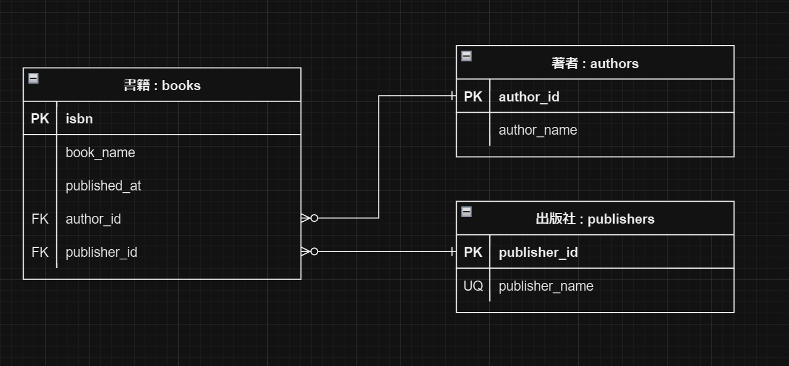

# 書籍管理アプリ API

このプロジェクトは書籍、著者、出版社を管理するための RESTful API を提供します。API を通じて、ユーザーは書籍の CRUD 操作を行うことができ、各書籍に紐づく著者や出版社の情報も管理できます。

## 主な機能

-   書籍の管理: 書籍の追加、更新、削除、リスト表示ができます。
-   著者の管理: 著者の追加、更新、削除、リスト表示ができます。書籍との紐づけも可能です。
-   出版社の管理: 出版社の追加、更新、削除、リスト表示ができます。書籍との紐づけも可能です。

## 技術スタック

- 言語: PHP
- フレームワーク: Laravel
- データベース: MySQL

## ER図

以下はアプリケーションのER図です：



## セットアップ手順

1. リポジトリをクローンする
```
git clone https://github.com/ren-mntn/backend_test.git
```
2. 依存関係をインストールする
```
composer install
```
3. 環境設定ファイル .env を設定する
4. データベースマイグレーションを実行する
```
php artisan migrate
```
5. サーバーを起動する
```
php artisan serve
```
## テストデータのセットアップ
プロジェクトにはテスト用のシーダーが含まれており、デモデータを使用してアプリケーションの機能をテストできます。
シーダーを使用してテストデータを生成するには、以下のコマンドを実行してください:
```
php artisan db:seed
```
このコマンドは、開発用データベースにテスト用の書籍、著者、出版社のデータを生成します。これにより、アプリケーションの各機能を手軽にテストできるようになります。

## APIエンドポイント
- 書籍に関するAPIエンドポイント
  - GET /api/books - すべての書籍をリスト表示
  - POST /api/books - 新しい書籍を追加
  - GET /api/books/{isbn} - 特定の書籍の詳細を表示
  - PUT /api/books/{isbn} - 特定の書籍を更新
  - DELETE /api/books/{isbn} - 特定の書籍を削除
- 著者に関するAPIエンドポイント
  - GET /api/author - すべての著者をリスト表示
  - POST /api/author - 新しい書籍を追加
  - GET /api/author/{id} - 特定の書籍の詳細を表示
  - PUT /api/author/{id} - 特定の書籍を更新
  - DELETE /api/author/{id} - 特定の書籍を削除
- 出版社に関するAPIエンドポイント
  - GET /api/publisher - すべての出版社をリスト表示
  - POST /api/publisher - 新しい出版社を追加
  - GET /api/publisher/{id} - 特定の出版社の詳細を表示
  - PUT /api/publisher/{id} - 特定の出版社を更新
  - DELETE /api/publisher/{id} - 特定の出版社を削除

### 著者の作成　(POST /api/authors)
- 必要なフィールド:`author_name`
### 以下は著者のリストのJSONサンプルです。(GET /api/authors)
```
[
    {
        "authorId": 1,
        "name": "Dr. Sarah Becker Jr."
    }
]
```
### 以下は著者の詳細のJSONサンプルです。(GET /api/authors/{id})
```
{
    "authorId": 1,
    "name": "Dr. Sarah Becker Jr.",
    "books": [
        {
            "isbn": "9782896909292",
            "name": "Ut quos qui necessitatibus beatae.",
            "publishedAt": "2004-09-24T00:00:00.000000Z",
            "authorId": 1,
            "publisherId": 1
        }
    ],
    "relatedPublishers": [
        {
            "publisherId": 1,
            "name": "Alberta Marquardt"
        }
    ]
}
```
### 出版社の作成　(POST /api/publishers)
- 必要なフィールド:`publisher_name`
### 以下は出版社のリストのJSONサンプルです。(GET /api/publishers)
```
[
    {
        "publisherId": 1,
        "name": "Alberta Marquardt"
    }
]
```
### 以下は出版社の詳細のJSONサンプルです。(GET /api/publishers/{id})
```
{
    "publisherId": 1,
    "name": "Alberta Marquardt",
    "books": [
        {
            "isbn": "9782896909292",
            "name": "Ut quos qui necessitatibus beatae.",
            "publishedAt": "2004-09-24",
            "authorId": 1,
            "publisherId": 1
        }
    ],
    "relatedAuthors": [
        {
            "authorId": 1,
            "name": "Dr. Sarah Becker Jr."
        }
    ]
}
```
### 書籍の作成　(POST /api/books)
- 必要なフィールド: `isbn`, `book_name`, `published_at`, `author_id`, `publisher_id`
## 以下は書籍のリストのJSONサンプルです。(GET /api/books)
```
[
    {
        "isbn": "9780258630266",
        "name": "Quisquam ut porro voluptate odio eum earum.",
        "publishedAt": "2000-06-01",
        "authorId": 3,
        "publisherId": 3
    }
]
```
### 以下は書籍の詳細のJSONサンプルです。(GET /api/books/9780258630266)
```
{
    "isbn": "9780258630266",
    "name": "Quisquam ut porro voluptate odio eum earum.",
    "publishedAt": "2000-06-01",
    "author": {
        "authorId": 3,
        "name": "Sheldon Herzog"
    },
    "publisher": {
        "publisherId": 3,
        "name": "Guadalupe Nienow"
    }
}
```
## バリデーションルール
### 書籍 (Books)
- isbn:
  - 必須項目
  - 文字列
  - 書籍の国際標準図書番号（ISBN）の形式に適合する必要があります。
  - ユニーク（既存の書籍と重複してはなりません）
- book_name:
  - 必須項目
  - 文字列
  - 最大255文字まで
- published_at:
  - 必須項目
  - 日付
  - Y-m-d 形式である必要があります（例: 2021-03-15）
- author_id:
  - 必須項目
  - 整数
  - 既存の著者IDと関連している必要があります。
- publisher_id:
  - 必須項目
  - 整数
  - 既存の出版社IDと関連している必要があります。
### 著者 (Authors)
- author_name:
  - 必須項目
  - 文字列
  - 最大255文字まで
  - HTMLタグは含まれていてはなりません。
### 出版社 (Publishers)
- publisher_name:
  - 必須項目
  - 文字列
  - 最大255文字まで
  - ユニーク（既存の出版社と重複してはなりません）
  - HTMLタグは含まれていてはなりません。

#### isbnのバリデーションについて
isbnの形式は、ISBN13を採用しており、以下のようなルールがあります。
- 978または979で始まる。
- その後に9つの数字が続く。
- 最後に１桁の数字またはXが続く。

このバリデーションの実装には、以下の資料を参考にしました。
[ISBNの構造について（国際ISBN機関）](http://www.torikyo.jp/new_isbn/tw_0609-1.pdf)